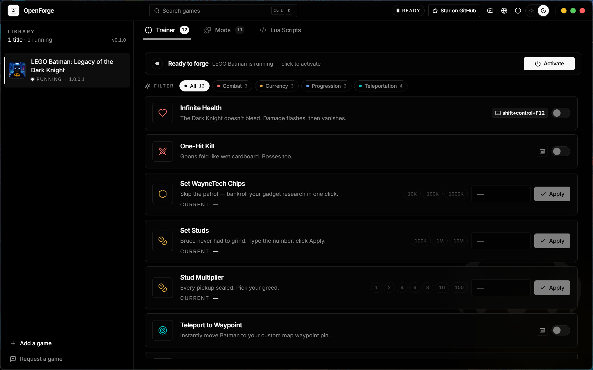
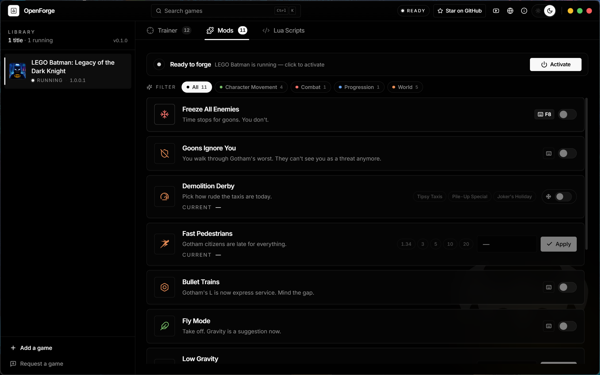
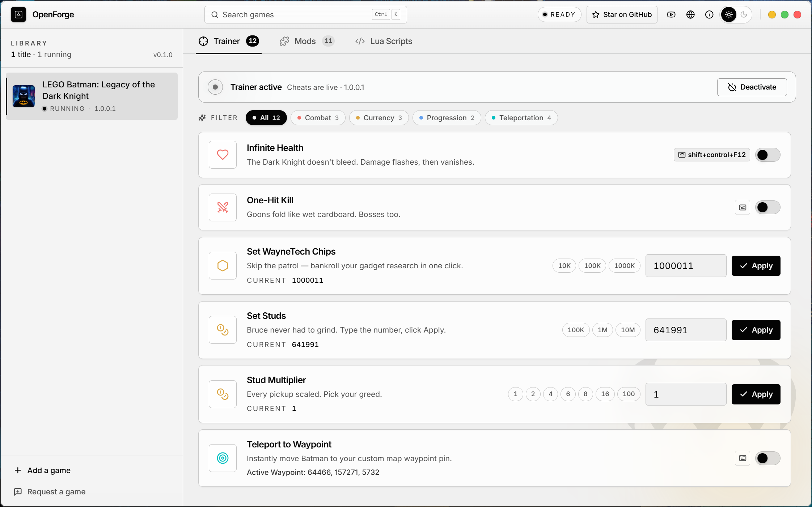
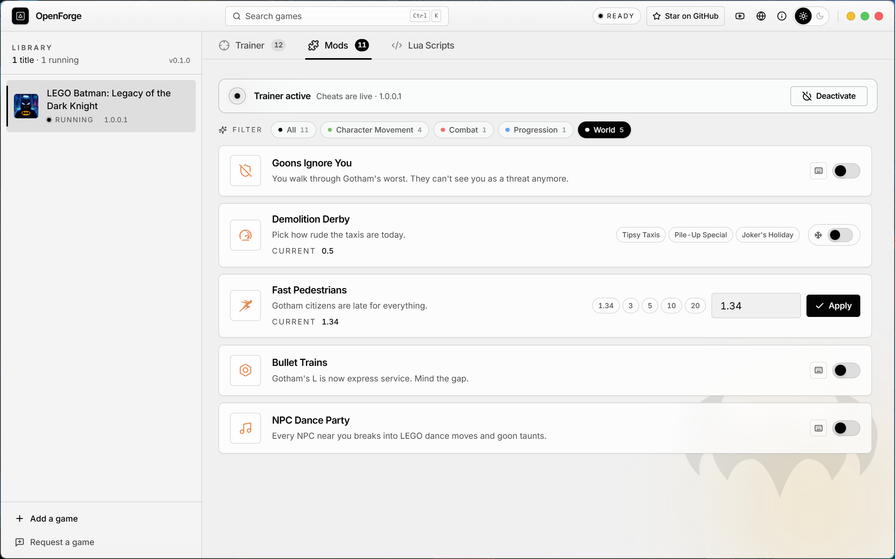

<div align="center">

# OpenForge

**Open-source, all-in-one trainer for offline single-player PC games.**

*Save-scumming is a craft, not a crime.*

[](LICENSE)
[](https://github.com/satyajiit/openforge-aio/releases)
[](https://www.rust-lang.org/)
[](https://tauri.app/)
[](https://github.com/satyajiit/openforge-aio/releases)
[](https://github.com/satyajiit/openforge-aio/stargazers)

[**▶ YouTube**](https://youtube.com/@GamesPatch) · [**★ Star**](https://github.com/satyajiit/openforge-aio) · [**🌐 theappstack.in**](https://theappstack.in) · [**🐛 Bug**](https://github.com/satyajiit/openforge-aio/issues) · [**🎮 Request a game**](https://github.com/satyajiit/openforge-aio/issues/new?labels=new-game)

</div>

---

## What it is

OpenForge attaches to a running offline single-player game and lets you tweak it — currency, health, fly mode, unlocks. One desktop app, every supported game, no per-game installers, no online anything.

The trick: **every cheat is a config file, not Rust code.** Contributors author signatures (TOML or RON); a declarative engine turns them into reads, writes, freezes, and code patches at runtime. Each game declares its engine in a manifest, and the right backend + injected DLL are selected from that. Adding a game is a folder drop — no recompile per cheat.

> Tauri 2 + Rust + config-driven signatures + per-engine reflection. Drop a folder, get a trainer.

---

## 📸 Screenshots

<div align="center">
<table>
  <tr>
    <td></td>
    <td></td>
  </tr>
  <tr>
    <td></td>
    <td></td>
  </tr>
</table>
</div>

---

## ✨ Highlights

- **Config-driven** — cheats are TOML/RON signatures, not code. Manifests declare the engine; backends are selected from that.
- **Reflection-based** — for reflection-capable engines, an injected DLL exposes the game's own object graph over a named pipe. Write `class_path` + `property_name`, skip the address chase.
- **Safe by default** — code patches auto-revert on detach; sub-100 ms re-attach via a per-session resolver cache.
- **Per-feature global hotkeys** — bind any chord, fires in the background, with conflict detection.
- **Local & open** — no telemetry, no cloud, hardened webview, MIT licensed.

---

## 🎮 Supported games

| Game | Engine | Features | Status |
|---|---|---|---|
| [LEGO Batman: Legacy of the Dark Knight](crates/games/batman-lod/README.md) | UE5 reflection | 26 | stable (build 1.0.0.1) |
| [007 First Light](crates/games/glacier-007/README.md) | Glacier 2 | 6 | beta (Denuvo-safe) |

Want yours added? [Open an issue](https://github.com/satyajiit/openforge-aio/issues/new?labels=new-game), or bring a PR — see [docs/GAME-AUTHORING.md](docs/GAME-AUTHORING.md).

---

## 🚀 Quick start

1. Grab the latest zip from [Releases](https://github.com/satyajiit/openforge-aio/releases).
2. Extract `openforge.exe` + the game's `*.dll` into the **same folder** (the trainer looks for the DLL next to its .exe).
3. Run `openforge.exe` **as administrator** (memory access needs it; the app prompts otherwise).
4. Launch your game and **load into actual gameplay** — not the main menu or a loading screen.
5. Hit **Attach**, toggle cheats.

> Cheats resolve against live game objects, which don't exist on the menu/loads. Back up saves before progression cheats.

---

## 🛠️ Build from source

Prereqs: **Rust 1.95+** (edition 2024), **Node 24**, **pnpm 10**, Windows 10+.

```powershell
cargo check --workspace            # compile check
cd crates/app && npx --yes pnpm@10 install && npx pnpm build

npx pnpm tauri:dev:fast            # run the app (recommended profile)

cargo run -p openforge-cli -- new-game --id <slug> --name "Game" --engine ue5 --format toml
```

CI gates (all must pass): `cargo fmt --check`, `cargo clippy -D warnings`, `cargo test --workspace --lib`, `openforge-cli verify-registry`, frontend `pnpm typecheck` + `build`.

---

## ⚠️ Scope

**Offline single-player only.** No online/competitive titles, no anti-cheat bypassing (BattlEye, EAC, EQU8, VAC…), ever — those PRs are declined. Not affiliated with any publisher; trademarks belong to their owners. Trainers poke process memory; rare crashes happen — back up saves. We ship no detection-evasion code.

---

## 📚 More

| Doc | What's inside |
|---|---|
| [docs/CONTRIBUTING.md](docs/CONTRIBUTING.md) | PR workflow + what we accept |
| [docs/GAME-AUTHORING.md](docs/GAME-AUTHORING.md) | Add a new game, end to end |
| [docs/UE5-CHEAT-COOKBOOK.md](docs/UE5-CHEAT-COOKBOOK.md) | Per-cheat UE5 recipes |
| [docs/ENGINE-FORMAT-ARCHITECTURE.md](docs/ENGINE-FORMAT-ARCHITECTURE.md) | The config-driven engine + format design |

---

<div align="center">

[MIT](LICENSE) © 2026 OpenForge contributors · *Made with 🦀 and late-night save-scumming.*

[**★ Star**](https://github.com/satyajiit/openforge-aio) · [**▶ Subscribe**](https://youtube.com/@GamesPatch)

</div>
